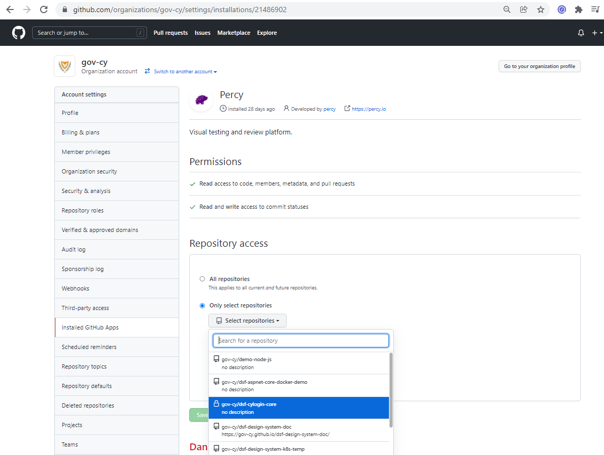

# Percy Visual Testing

## Intruduction 

This document describes how you can setup a Percy project, connect it with a GitHub repository and how to use it from the command line or as part of the review builds.

## Prerequisites

- Access to [gov-cy](https://github.com/gov-cy) organization settings on Github 
- [Percy Github App](https://github.com/apps/percy) installed for the `gov-cy` organization 
- Access to [Percy](https://percy.io/)
- nmp package [@percy/script](https://docs.percy.io/docs/percyscript) is installed

## Steps to set it up

1. Give permissions on Percy Github App to access the desired repository
	- Go to https://github.com/organizations/gov-cy/settings/installations and click `Configure` for the Percy App
	- Under the `Repository Access` Click on `Select repositories` and select the desired repository.
	- Click `Save`
	
	
 
2.	Create new project in Percy
	- Go to Percy's organization page (https://percy.io/a0d81626)
	- Click `Create new project`
	- Complete the `Project name` and `Link a repository` (see image below)
	- Click `Create Project`
	
    
	
3. Set PERCY_TOKEN in repository secret
	- From the Percy project page copy the `PERCY_TOKEN` value.
	
	
	
	- Go to repository's settings page in Github, click on `Secrets` (i.e. https://github.com/gov-cy/dsf-design-system/settings/secrets/actions URL is different depending on repository)
	- Click `New repository secret` and enter under *Name* `PERCY_TOKEN` and under *Value* paste the token value.
	
	

4. Create npm test script 
    - In this step you will need to create a test script that will be used to generate the screenshots and add them to Percy. Depending on the technology used (such as Ember, Cypress, Capybara, Storybook e.t.c) Percy has *how to* tutorials at https://docs.percy.io/docs/example-apps. In this tutorial we are using [PercyScript](https://docs.percy.io/docs/percyscript) which uses the `@percy/script` npm package.
    - Create a test script under `test\scripts\percy.js`. 
    
      Use the `page.goto(URL)` and `percySnapshot(snapshotName, [options])` methods to navidate to a page and take snapshots. 
    
      See below a sample test script.

```js 
const PercyScript = require('@percy/script');
const httpServer = require('http-server');

const PORT = process.env.PORT_NUMBER || 3000;
const TEST_URL = `http://localhost:${PORT}/build`;

// A script to navigate our app and take snapshots with Percy.
PercyScript.run(async (page, percySnapshot) => {
  let server = httpServer.createServer();
  server.listen(PORT);

  console.log(`Server started at ${TEST_URL}`);

  // Take snapshoots on TEST_URL page
  await page.goto(TEST_URL);
  await percySnapshot('index',{ widths: [375, 767, 1280] });

  // Take snapshoots of another page
  await page.goto(TEST_URL + '/my-cool-new-page');
  await percySnapshot('Cool New Page',{ widths: [375, 767, 1280] });

  server.close();
});

```	

5. Create npm script to run test
    - Add the following in your `package.json` file under `scripts`

```js
"test-percy": "percy exec -- node tests/scripts/percy.js"
```

6. Test your script from the `command line`
    - You first need to set the enviromental variable `PERCY_TOKEN`. For example on Windows `set PERCY_TOKEN=XXXXXXXXXXXXXXXXXXXXXXXXXXXXXXXXXXXXXX`
    - Then simply run `npm run test-percy`
    - If all goes well a link will appear in the command line where you can view the screenshoots.

7. Create a github workflow 
    - Create a workflow file under `.github/workflows/percy.yml`. See below a sample workflow which fires on pull requests and push on main branch.

```yml
name: Percy CI
on: 
  # Trigger the workflow on push or pull request,
  # but only for the main branch
  push:
   branches:
     - main
  pull_request:
    branches:
     - main
jobs:
  build:
    runs-on: ubuntu-latest
    steps:
      - name: Checkout
        uses: actions/checkout@master
      - name: Install
        run: npm install
      - name: Percy Test
        uses: percy/exec-action@master
        with:
          command: "node tests/scripts/percy.js"
        env:
          PERCY_TOKEN: ${{ secrets.PERCY_TOKEN }}

```

## Run percy from command line

From the `command line`
- You first need to set the enviromental variable `PERCY_TOKEN`. For example on Windows `set PERCY_TOKEN=XXXXXXXXXXXXXXXXXXXXXXXXXXXXXXXXXXXXXX`
- Then simply run `npm run test-percy`
- If all goes well a link will appear in the command line where you can view the screenshoots. 

## Github review builds

Once you've added the app and linked projects with repositories, subsequent Percy builds will show metadata from GitHub and Percy will automatically update the pull request summary if there are visual differences waiting for review.


*Note: By default, Percy approvals aren’t required before merging, but you can enable this feature once you’re ready for it.*

Clicking "Details" will take you directly to the Percy build UI showing all visual diffs to be reviewed. 
  	

  
Approving a build in Percy sets the Percy status in GitHub to green/successful, so that your team can see that any visual changes were reviewed and approved.


### Adding comments

To add a comment and start a comment thread, select the icon in the snapshot header.


### Changes requested workflow

In addition to approving snapshots with visual changes, you can also “request changes.” 


## Percy features 

### Cross-browser visual testing

Cross-browser visual testing is available for all Percy customers to effortlessly see visual changes across different browsers.

Percy currently supports modern Chrome, Firefox, Edge and Safari browsers, with support for more browsers in the works. Browser upgrades are handled automatically.


### Responsive visual testing

You can perform visual testing for responsive user interfaces, allowing you to automatically detect visual regressions on mobile, tablet, and desktop screens at once.

