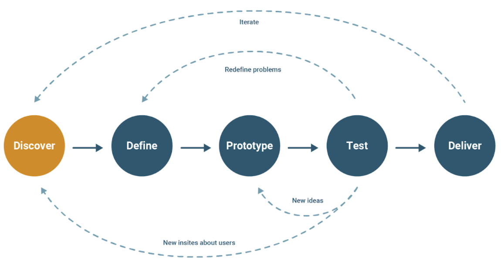
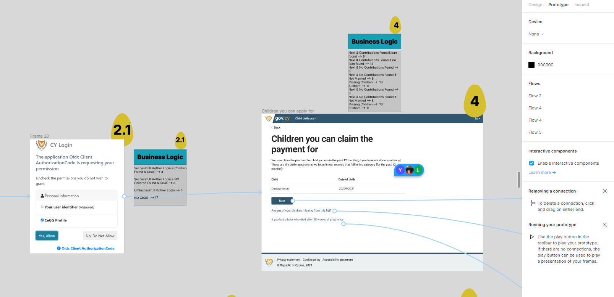

# UCD Tech collaboration

## Introduction

This document describes a process for collaboration between User Centred Design (UCD) and Technical teams. The approach tries to combine an Agile way of working with the User Centred  Design approach and focuses on eliminating the bottleneck created from design changes that occur during development due to constant iteration (as shown in the diagram below). 

## Who is UCD

- User Researchers
- Service Designers
- Content Designers 
- Interaction Designers

## Process

### Pre-development
- The UCD team should **include developers** and other members of the Tech team while designing the service.
  - Arrange regular meetings with the Tech team to keep them on the same page while designing

- The UCD team **finalizes** the designs of each screen on Figma and keep **locked version** as a reference for the Tech team. 
  - Each screen on Figma should be **assigned a number** (1,2,3 ) for easy reference (appearing in a circle next to the screen on Figma) 
  - Each screen on Figma should have **business logic** explained in bullet point format in a rectangle above the screen 
  - The prototype functionality of Figma could also be used to show links between links, buttons with other screens
- The UCD team arranges a **walk through**  of the “*finalized*” design to the whole team. Finalized means at the current iteration. 

### During Development

- If the **Tech team has questions** that cannot be answered easily they should create a ticket in Trello.
- The Tech team should **deploy testable versions** of the service on a staging environment as soon as possible. With each deployment: 
  - Tech team should explain **what has been implemented and what is not**
  - The whole team should **test the service** in terms of:
    - Business rules
    - User Journey
    - Integrations working
    - Design System
    - Security Standards
    - .... ???
  - If an **issue arises during testing**, each member that comes across it should create a ticket on Trello describing:
    - Page where problem arose 
    - Description of issue. Make sure the devs can understand what the problem is and how to recreate it.
    - What actions need to be taken so the issue is considered done.
    - Screenshoot (optional)

### Working with Issue Tickets

- The person that creates the ticket should be the owner 
- The tickets must be communicated in the Stand up 
- The tickets should be picked up by the team/role that should solve the ticket ???????
- When done should be reviewed by the owner and the appropriate roles of the ticket before it is moved to done. 

